# Add HDB Resale Data into Supabase

## Account Creation
- Create a free account if you have not already done so.
- First, enter a project name
- Next, enter a database password

## Preparing and Download CSV
- Download the csv file on HDB resale price from the website https://data.gov.sg
- Please note that as of March 2025, there should be around 201K rows.

## Importing CSV to Supabase
- Create a table under table editor but do not enter anything yet.

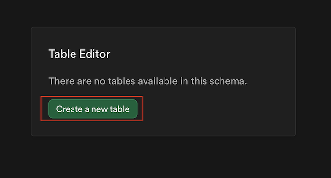

- Enter the table name as shown:

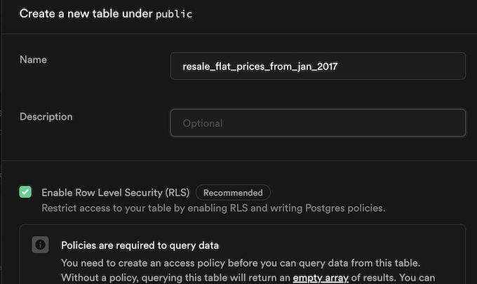

- Click to Import Data

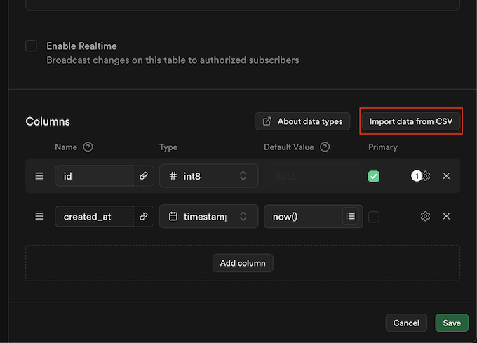

- Click browse (some classmate got issue with drag and drop)

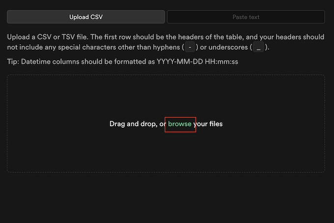

- Once your file is loaded, you should see something like below, click save to import:

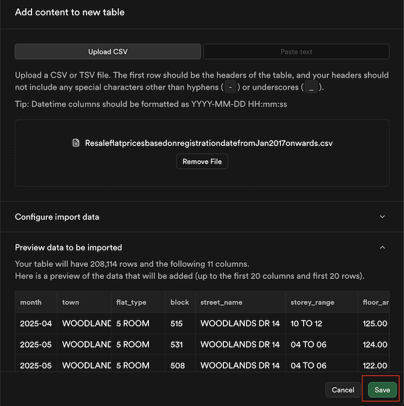

- Click save again

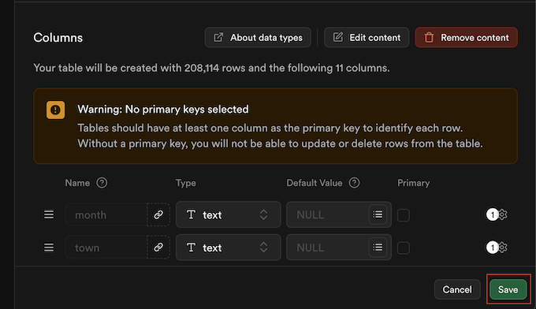

- You should see the import progress as shown below, this will take a while:

### Create primary key
- Once it is done, we need to add primary key, click insert

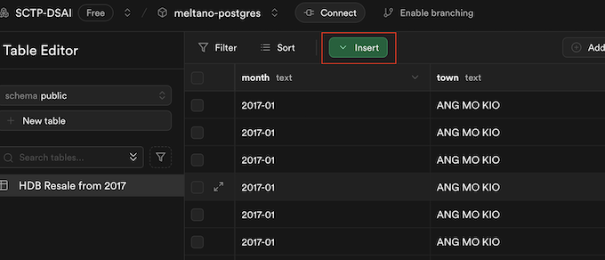

- Select columns

- Set the id, type and identity

- Follow the checks below and click save:

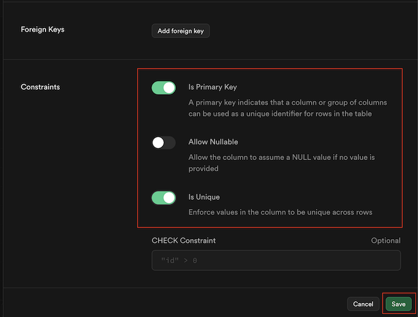

- We should have the result below:

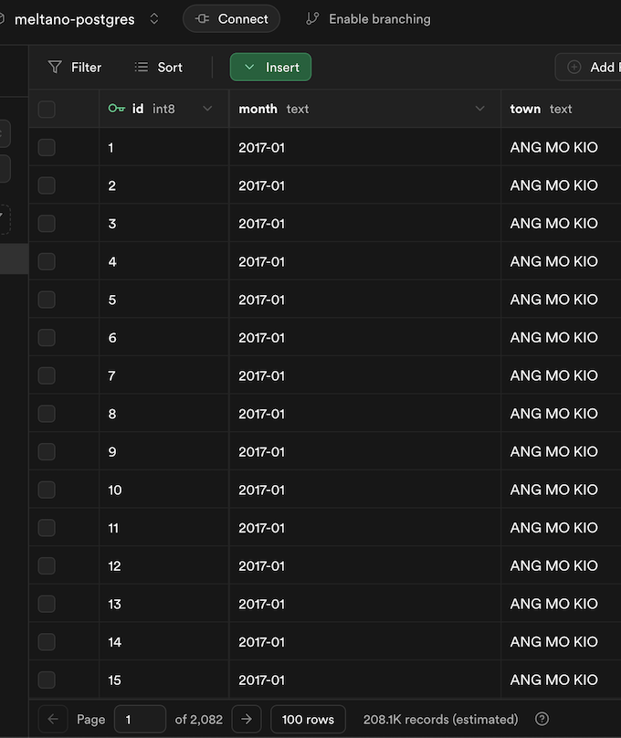

## Connection with Supabase
To get the connection setting from Supabase, please follow the steps below:

- Click connect

- You can select any type, the setting should be similar. If you want to test your connection in Python, you can select Python or SQLAlchemy
- If you select Python or SQL Alchemy, they also provided code in Python for us to test the connection. This is useful.
- For demonstration purpose, we stick to URI
- Next we will be given 3 connection methods
- We will focus on 2 connection methods, `direct connection` and `Session pooler (Supavisor)`
- You could try direction connection first, if there is connection issue try session pooler.

### Get Connection Parameters - Direct Connection
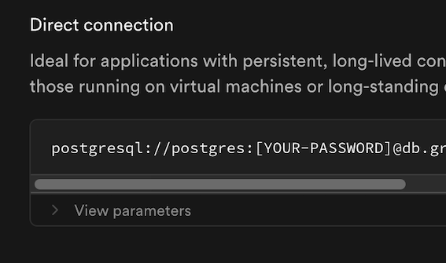
- Click `View parameters`
- The settings that is related to your database will be presented to you.

### Get Connection Parameters - Session pooler
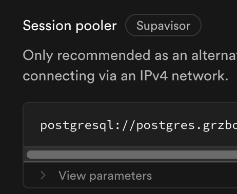
- Click `View parameters`
- The settings that is related to your database will be presented to you.

### Testing Connection
If you encounter connection issues with Meltano, you can try choosing Python or SQLAlchemy.

Next to the connection string, the code to test the connection is provided.

### Possible Connection Error
Supabase, uses IPV6 for direct connection, so the problem may depend on your ISP. Anyway, the following warning is shown:

Try direct connection first and if it does not work, use session pooler.

Reference link: https://supabase.com/docs/guides/database/connecting-to-postgres
